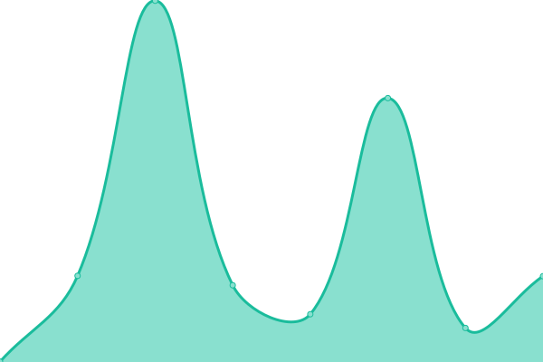

# Performance and availability monitoring

## <!--live status--> **🟩 All systems operational**

<!--start: status pages-->
<!-- This summary is generated by Upptime (https://github.com/upptime/upptime) -->
<!-- Do not edit this manually, your changes will be overwritten -->
<!-- prettier-ignore -->
| URL | Status | History | Response Time | Uptime |
| --- | ------ | ------- | ------------- | ------ |
|  [s-bars](https://s-bars.com) | 🟩 Up | [s-bars.yml](https://github.com/alextim/upptime/commits/HEAD/history/s-bars.yml) | 

 709ms
     
 | 

<a href="https://alextim.github.io/upptime/history/s-bars">100.00%</a>
    

|  [IGRYG](https://igryg.com) | 🟩 Up | [igryg.yml](https://github.com/alextim/upptime/commits/HEAD/history/igryg.yml) | 

 404ms
     
 | 

<a href="https://alextim.github.io/upptime/history/igryg">100.00%</a>
    

|  [Climbing in Turkey](https://climbing-in-turkey.netlify.app) | 🟩 Up | [climbing-in-turkey.yml](https://github.com/alextim/upptime/commits/HEAD/history/climbing-in-turkey.yml) | 

 0ms
     
 | 

<a href="https://alextim.github.io/upptime/history/climbing-in-turkey">100.00%</a>
    

<!--end: status pages-->

## 📄 License

- Powered by: [Upptime](https://github.com/upptime/upptime)
- Code: [MIT](./LICENSE) © [alextim](https://alextim.github.io/upptime)
- Data in the `./history` directory: [Open Database License](https://opendatacommons.org/licenses/odbl/1-0/)
